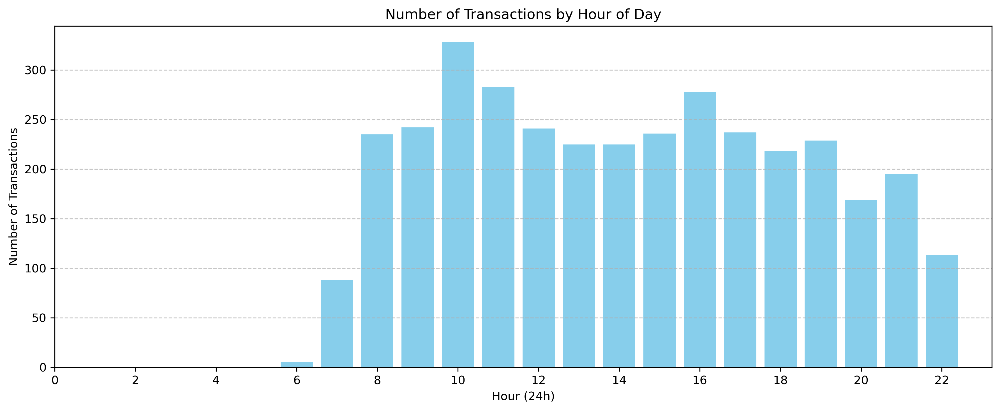
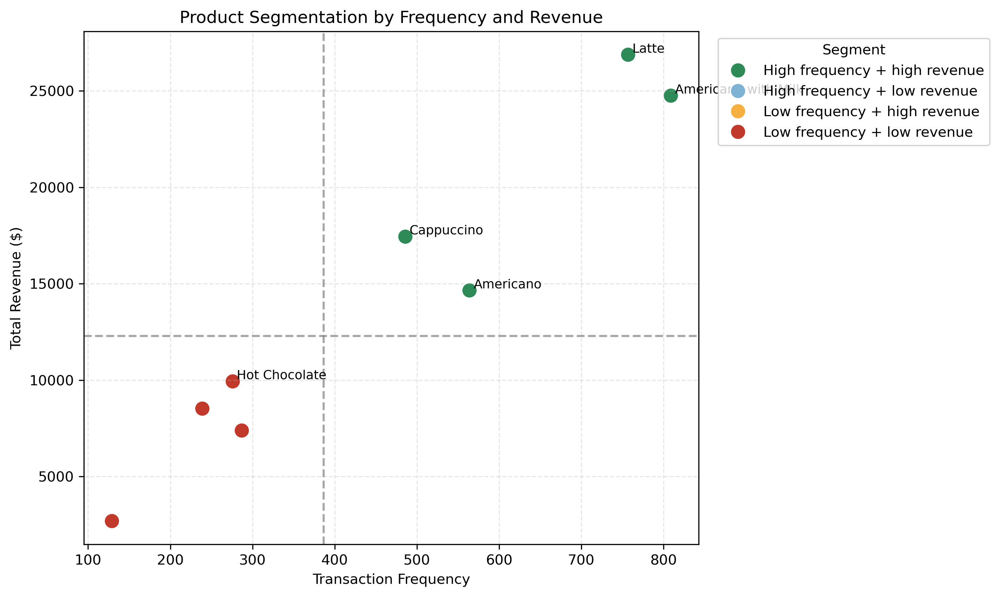

# Coffee Sales Analysis for Small Business Decision-Making

## Executive Summary

This project analyses a coffee sales dataset to identify sales patterns that support evidence-based decision-making for small businesses. The findings show that weekdays generate substantially more transactions than weekends, `10:00` is the busiest hour, the `30-50` price band is the most popular, and `March` records the highest revenue. The analysis therefore provides practical evidence for staffing, pricing, product focus, and promotion planning. The repository presents these results through a reproducible Python notebook workflow.

## 1. Problem & User

This project analyses coffee shop transaction data to support more evidence-based business decisions. The main target user is a coffee shop manager or small business owner who wants practical insights on peak demand, customer spending, product popularity, and revenue trends.

## 2. Data

- Dataset: `Daily Coffee Transactions` from Kaggle
- Access date used in the coursework: `08 April 2026`
- Local data file in this repo: `data/coffee_sales.csv`
- Number of records analysed: `3547`
- Key fields:
  - `hour_of_day`
  - `money`
  - `coffee_name`
  - `Weekday`
  - `Month_name`
  - `Time_of_Day`
  - `Date`

## 3. Methods

The analysis was completed in Python using a Jupyter Notebook workflow.

Main steps:

1. Import `pandas`, `matplotlib`, `seaborn`, `numpy`, and `scipy`
2. Load the transaction dataset using a relative path
3. Check missing values and basic data structure
4. Clean and rename columns for analysis
5. Perform descriptive analysis on transactions, products, and price levels
6. Analyse hourly, weekday/weekend, and monthly transaction patterns
7. Visualise the main outputs using exported charts
8. Test weekday and weekend transaction values using a Mann-Whitney U comparison
9. Segment products by transaction frequency and total revenue
10. Summarise findings and interpret them in a business context

## 4. Key Findings

- The busiest trading hour is `10:00`, with `328` transactions.
- Weekday sales volume is much higher than weekend sales volume: `2658` versus `889`.
- `March` is the peak month in this dataset, with `494` transactions.
- The two most popular drinks are `Americano with Milk` and `Latte`.
- The strongest transaction price band is `30-50`, with `2345` purchases.
- A Mann-Whitney U test suggests that weekday and weekend transaction values are not statistically different at the 5% level, even though weekday transaction volume is much higher.
- `Latte`, `Americano with Milk`, `Cappuccino`, and `Americano` behave as both high-frequency and high-revenue products in the product segmentation view.
- The average order value is `$31.65`, and the highest monthly revenue occurs in `March`.

### Business Recommendations

- Increase staffing coverage between `09:00` and `11:00` because demand peaks at `10:00`, and faster service during the busiest trading window can reduce queueing and lost sales.
- Prioritise weekday staffing and inventory preparation because weekday traffic is substantially higher than weekend traffic, making labour allocation more efficient when matched to observed demand patterns.
- Keep the `30-50` range as the core pricing band because it captures the strongest share of purchases and provides the clearest basis for bundle design or menu positioning.
- Use targeted weekend promotions to lift traffic rather than assuming higher willingness to pay, because statistical testing suggests weekday and weekend transaction values are very similar.
- Feature `Latte`, `Americano with Milk`, `Cappuccino`, and `Americano` more prominently because they combine strong purchase frequency with high revenue contribution.
- Schedule seasonal campaigns before and during `March` because it is the strongest month for both transactions and revenue, while treating this as operational timing evidence rather than a forecasting result.

## 5. How to Run

1. Open `notebooks/notebook.ipynb` in Jupyter Notebook, JupyterLab, or VS Code.
2. Keep the repository structure unchanged, especially `data/coffee_sales.csv` and the `figures/` folder.
3. Run all cells from top to bottom.
4. The notebook will save the chart outputs into the `figures/` folder.
5. Review the printed outputs and exported figures.

Packages used in the notebook are listed in `requirements.txt`.

## 6. Product Link / Demo

- GitHub repository: [Laura7797/Coffee-sales](https://github.com/Laura7797/Coffee-sales)
- Main notebook demo: `notebooks/notebook.ipynb`
- Optional interactive prototype: `Coze workflow link to be inserted here`
- Example output figure:

If the image does not render in a local preview, open it directly from:
`figures/transaction_values_distribution.png`

The Coze workflow is included only as a supplementary interactive prototype. The main coursework product remains the Python notebook and the documented evidence presented in this repository.

## 7. Limitations & Next Steps

Limitations:

- The dataset reflects one business context, so the findings are not fully generalisable.
- The analysis is descriptive rather than predictive.
- Some behavioural interpretations are exploratory and should not be considered causal evidence.
- External factors such as weather, promotions, store location, and customer demographics are not included.

Next steps:

- Extend the project into forecasting only after a richer multi-period dataset is available
- Compare multiple stores or multiple periods for stronger conclusions
- Add more business variables so that statistical comparison can be extended beyond transaction values
- Build a cleaner interactive demo if the coursework later requires a product layer

## Repo Structure

- `README.md`
- `requirements.txt`
- `data/coffee_sales.csv`
- `notebooks/notebook.ipynb`
- `figures/transaction_values_distribution.png`
- `figures/hourly_transactions.png`
- `figures/monthly_transaction_trend.png`
- `figures/average_spending_by_hour.png`
- `figures/price_range_demand.png`
- `figures/drink_price_vs_popularity.png`
- `figures/weekday_weekend_statistical_comparison.png`
- `figures/product_segmentation_frequency_revenue.png`

## Coursework Note

This repository is prepared for the `track2` direction, focusing on a documented Python analysis project with a clearer structure, stronger reproducibility, and a more professional GitHub presentation.
