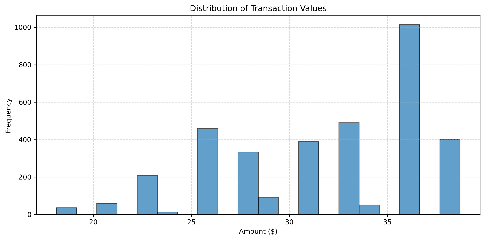

# Coffee Sales Analysis for Small Business Decision-Making

## 1. Problem & User

This project analyses coffee shop transaction data to support more evidence-based business decisions. The main target user is a coffee shop manager or small business owner who wants practical insights on peak demand, customer spending, and product popularity.

## 2. Data

- Dataset: `Daily Coffee Transactions` from Kaggle
- Access date used in the coursework: `08 April 2026`
- Local files in this repo:
  - `data/Coffe_sales.csv`
  - `Coffe_sales.csv` (kept in the root folder for compatibility with the earlier notebook version)
- Number of records analysed: `3547`
- Key fields:
  - `hour_of_day`
  - `money`
  - `coffee_name`
  - `Weekday`
  - `Month_name`
  - `Time_of_Day`
  - `Date`

## 3. Methods

The analysis was completed in Python using a Jupyter Notebook workflow.

Main steps:

1. Import `pandas`, `matplotlib`, `seaborn`, and `numpy`
2. Load the transaction dataset
3. Check missing values and basic data structure
4. Clean and rename columns for analysis
5. Perform descriptive analysis on transactions, products, and price levels
6. Analyse hourly, weekday/weekend, and monthly patterns
7. Visualise the results using charts
8. Summarise findings and discuss them in a business and behavioural-economics context

## 4. Key Findings

- The busiest trading hour is `10:00`, with `328` transactions.
- Weekday sales volume is much higher than weekend sales volume: `2658` versus `889`.
- `March` is the peak month in this dataset, with `494` transactions.
- The two most popular drinks are `Americano with Milk` and `Latte`.
- The strongest transaction price band is `30-50`, with `2345` purchases.

## 5. How to Run

1. Open `notebook.ipynb` in Jupyter Notebook, JupyterLab, or VS Code.
2. Make sure the repo keeps the current structure, especially the `data/` folder.
3. Run all cells from top to bottom.
4. Review the printed outputs and figures.

Packages used in the notebook are listed in `requirements.txt`.

## 6. Product Link / Demo

- GitHub repository: [Laura7797/Coffee-sales](https://github.com/Laura7797/Coffee-sales)
- Main notebook demo in this local version: `notebook.ipynb`
- Example output figure:

## 7. Limitations & Next Steps

Limitations:

- The dataset reflects one business context, so the findings are not fully generalisable.
- The analysis is descriptive, not predictive.
- Some behavioural economics discussion is interpretive and should not be treated as causal proof.
- External factors such as weather, promotions, store location, and customer demographics are not included.

Next steps:

- Add more visual outputs into the `figures/` folder
- Extend the analysis with forecasting or segmentation methods
- Compare multiple stores or multiple periods for stronger conclusions
- Build a cleaner interactive demo if the coursework later requires a product layer

## Repo Structure

- `README.md`
- `notebook.ipynb`
- `Mini_Assessment_fixed.ipynb`
- `data/`
- `figures/`
- `requirements.txt`
- `Reflection report.docx`

## Coursework Note

This repository is prepared for the `track2` direction, focusing on a documented Python analysis project with a clear GitHub presentation.
